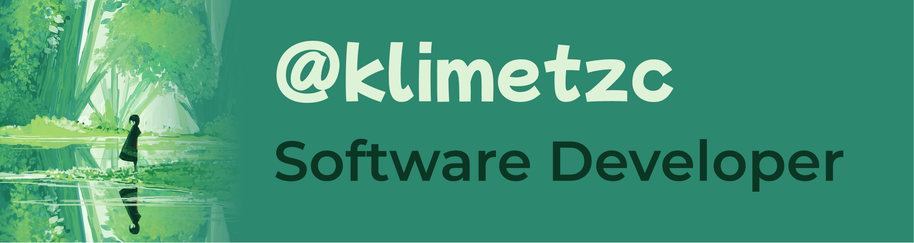

  <pre>
  ╭─┤ <b>WHOAMI</b> ├───────────────────────────────────── ✔ @klimetzc ₪
  ├─▢ Software Developer
  ├─▢ Languages: TypeScript/JavaScript
  ├─▢ Socials : <a href="https://t.me/klimetzc" target="_blank">Telegram</a>
  ├─▢ Activity: Currently working on <a href="https://stattrack.ru">Stattrack</a>
  ╰─────────────────────

  ╭─┤ <b>SKILLS</b> ├───────────────────────────────────── ✔ @klimetzc ₪
  ├─▢ Layout&Styling: Css(BEM), Scss, Styled-components
  ├─▢ Frontend frameworks: React, Next
  ├─▢ State: Redux Toolkit, Mobx, SWR
  ├─▢ UI: Ant Design, Tailwind
  ├─▢ Bundlers: Vite, Rollup, Parcel
  ├─▢ Animation: Framer Motion
  ├─▢ Backend frameworks: NestJS, Express
  ├─▢ Databases: PostgreSQL, Redis, MongoDB
  ├─▢ ORMs: PrismaORM, mongoose
  ├─▢ Infrastructure: Turborepo, Docker
  ╰─────────────────────
  </pre>

